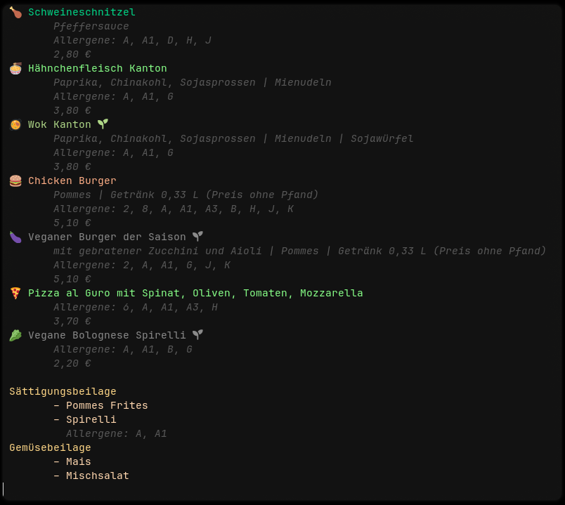

# acmensa-cli

A fetcher/parser library + prettyprint CLI for menus of 
the Mensen of Studentenwerk Aachen (not affiliated).



## Features

- 📦 Completely separated fetching/parsing/datamodel [library](libacmensa/) for integration into other projects.
- 🌐 German 🇩🇪 (default) and English 🇬🇧 output.
- ✨ Prettyprint:
    - ⚙️ Customisable [format](res/pretty-print.toml) (recompilation needed!).
    - 🌱 Alternative format for veganised non-vegan meals (e.g. Klassiker swapped for vegan).
    - 🔍 Skip vegan meals, or output only a certain category.
- 📤 JSON export.

## Usage

`acmensa-cli [OPTIONS] (menu|export) [subcommand options...]`

The main options (`OPTIONS`) are

```java
  -m, --mensa <MENSA>  Target mensa [default: ahornstrasse] [possible values: academica, ahornstrasse, bistro-templergraben, bayernallee, eupener-strasse, kmac, suedpark, vita, juelich]
  -e, --english        Switch to English. Default is German
  -h, --help           Print help
  -V, --version        Print version
```

### Menu subcommand
`menu` fetches and displays (or dumps the json) of a single daily menu for a single mensa.

```java
Usage: acmensa-cli menu [OPTIONS]

Options:
  -j, --json
          Print JSON of day plan

      --date <DATE>
          ISO Date (YYYY-MM-DD). Takes precedence over --day/-d

  -d, --day <DAY>
          Day description

          Possible values:
          - today: The day of today
          - next:  Next day (tomorrow, or Monday if it's a weekend)

          [default: today]

  -o, --only <ONLY>
          Only print meals of the given category

  -e, --english
          Switch to English. Default is German

  -s, --short
          Only print headline for main meals. Takes precedence over other specific options

  -p, --prices
          Print meal prices

  -m, --skip-sides
          Do not print sides

  -n, --skip-vegan
          Do not print vegan meals

  -a, --allergens
          Print allergens. (No guarantee that they are parsed correctly!)

  -h, --help
          Print help (see a summary with '-h')
```

### Export subcommand

`export` fetches all available daily menus for a single mensa and writes them into JSON
files (`YYYYMMDD.json`).

```java
Usage: acmensa-cli export [OPTIONS]

Options:
  -o, --output <OUTPUT>  Put files in this directory
  -h, --help             Print help
```

The output schema can be found in [static/schema.json](static/schema.json) or generated directly
via `acmensa-cli schema` (needs to be compiled with feature `json-schema`)
